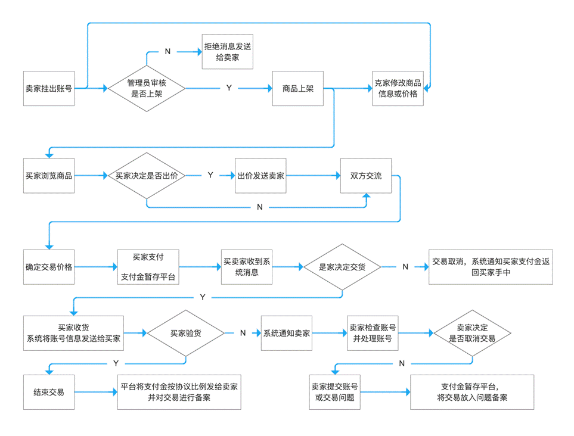
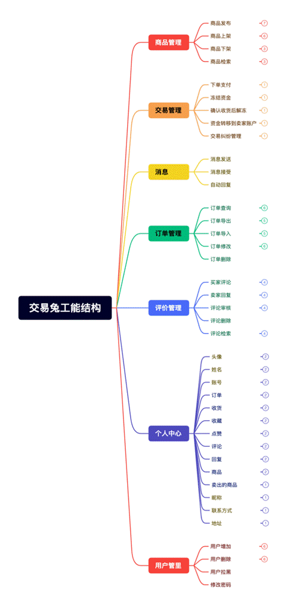
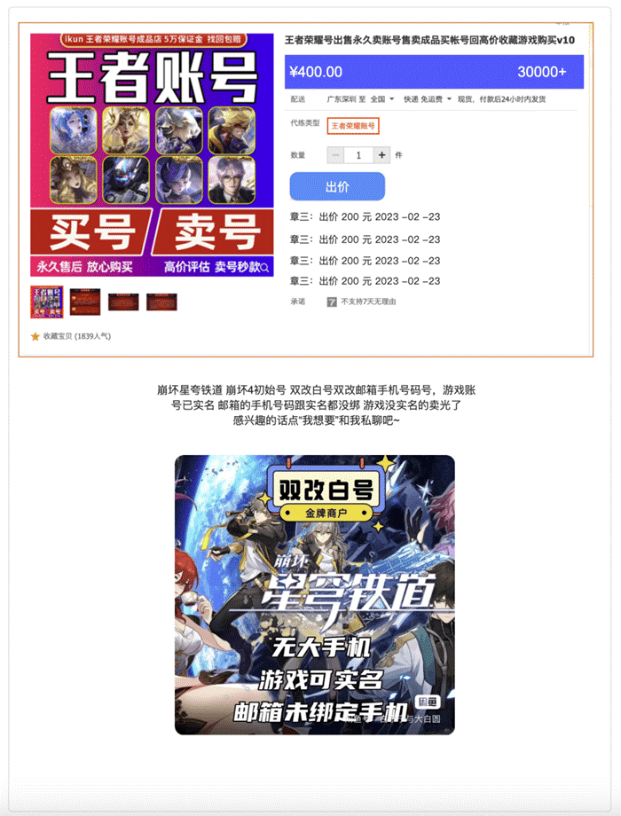
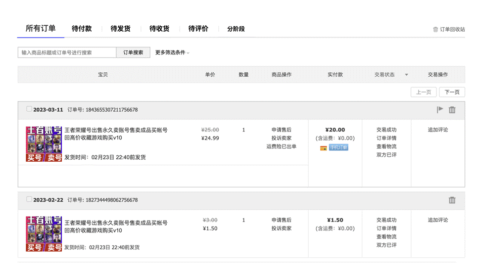
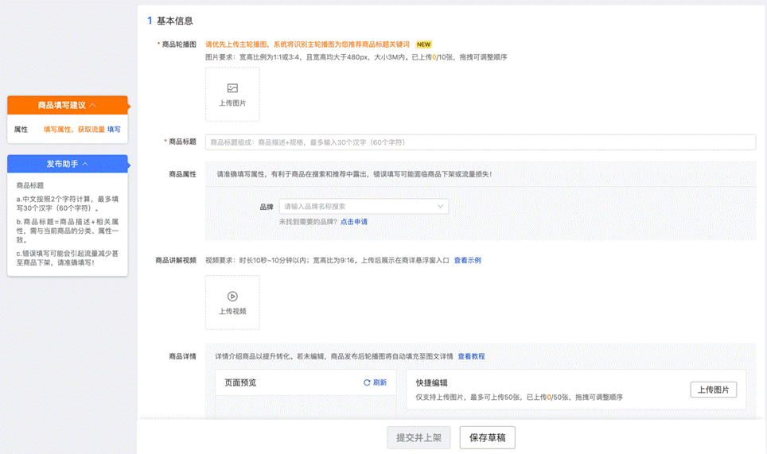
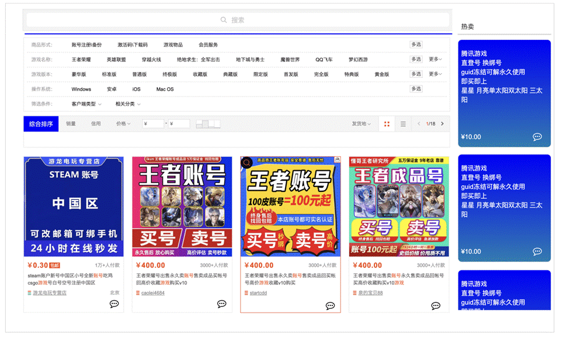
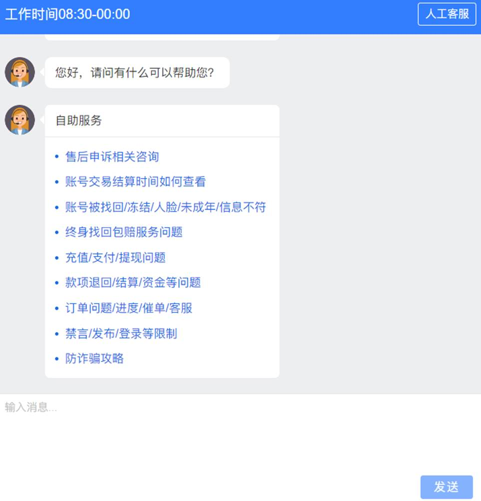
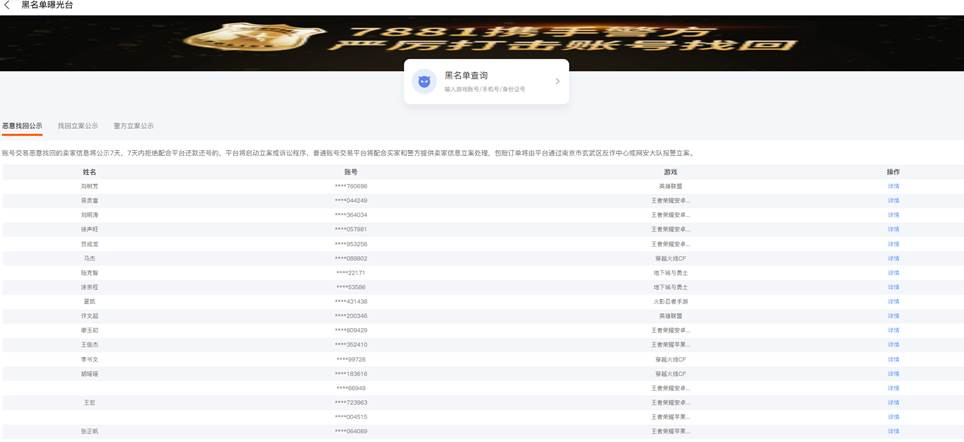
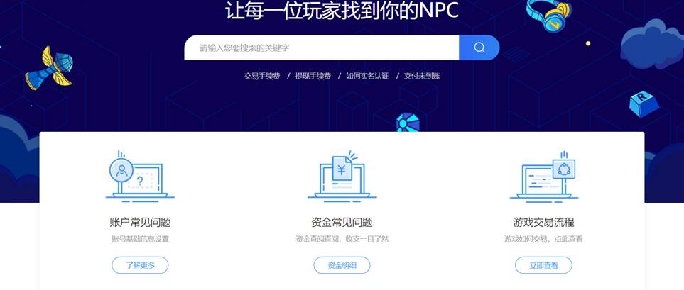
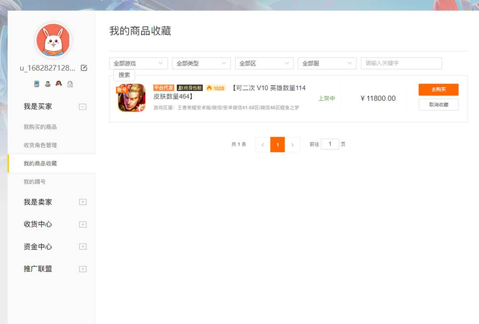

# 易游

一个基于Springboot实现的二手游戏账号交易平台。

# 产品需求说明书

| 文档版本号： | v1.0       | 文档编号：      | 20230425      |
| ------------ | ---------- | --------------- | ------------- |
| 文档密级：   | 仅限项目组 | 归属部门/项目： |               |
| 产品名：     | 易游       | 子系统名：      |               |
| 编写人：     |            | 编写日期：      | 2023年3月24日 |

# 目 录

[产品需求说明书.......................................................................... 1](#_Toc133416003)

[第一章 简介................................................................................ 2](#_Toc133416004)

[1.1 产品概述及目标............................................................................... 2](#_Toc133416005)

[第二章 用户角色需求描述........................................................ 4](#_Toc133416006)

[第三章 产品功能概述................................................................ 4](#_Toc133416007)

[3.1 产品功能架构图............................................................................... 4](#_Toc133416008)

[3.2 产品功能介绍.................................................................................... 5](#_Toc133416009)

[3.2.1 支持交易功能..................................................................................................... 5](#_Toc133416010)

[3.2.2 支持订单管理..................................................................................................... 6](#_Toc133416011)

[3.2.3 支持商品发布..................................................................................................... 7](#_Toc133416012)

[3.2.4 支持商品搜索..................................................................................................... 8](#_Toc133416013)

[3.2.5 支持评价功能..................................................................................................... 9](#_Toc133416014)

[3.2.6 支持社交功能.................................................................................................. 10](#_Toc133416015)

[3.2.7 支持账户安全功能........................................................................................ 11](#_Toc133416016)

[3.2.8 支持交易保障.................................................................................................. 12](#_Toc133416017)

[3.2.9 支持交易纠纷处理........................................................................................ 13](#_Toc133416018)

[第四章 其它产品需求.............................................................. 13](#_Toc133416019)

[4.1 性能需求.......................................................................................... 13](#_Toc133416020)

[4.2 兼容性需求...................................................................................... 14](#_Toc133416021)

 

 

 

 

 

 

# 第一章  简介

## 1.1  产品概述及目标

本文档旨在描述交易兔二手游戏账号交易平台的产品需求。该平台将提供让用户可以买卖游戏账号、物品和货币的服务。该平台必须具备用户注册与登录、发布商品信息、购买商品、支付和结算及安全保障等基本功能。

# 第二章  用户角色需求描述

# 第三章  产品功能概述

## 3.1  产品功能架构图

## 3.2  产品功能介绍

### 3.2.1  支持交易功能

1. 用户可以进行买入或卖出订单的操作，根据市场价格或指定价格进行交易。
2. 交易功能提供市价单和限价单两种交易方式。
3. 市价单是按照市场实时价格成交的订单，而限价单则是根据用户指定的价格成交的订单。
4. 用户可以在交易平台上进行撤单操作，取消未成交的订单。

 

### 3.2.2  支持订单管理

交易记录是指用户在交易平台上进行交易时所产生的数据记录，包含以下内容：

1. 下单时间：交易发生的具体时间，年、月、日，连字符用“—”。
2. 商品名称：卖家上传商品输入的商品名称。
3. 数量：交易的数量，下单时选择的数量。
4. 实付款：最终下单成交价格。
5. 手续费：交易产生的手续费用，例如交易平台的手续费、清算费。
6. 总金额：交易的总金额，。
7. 订单单号：交易所产生的编号，方便用户查询交易记录和资产情况，20位 递增。
8. 交易状态：交易的状态，待付款、待收货、待收货。
9. 追加评论：可以追加两次评论。

 

### 3.2.3  支持商品发布

商品发布功能是指用户在交易平台上发布自己的商品信息，包含以下内容：

1. 商品名称：发布的商品的名称（游戏账号名称）。
2. 商品描述：商品的详细描述，包括游戏账号的平台、人物角色、等级等信息。
3. 商品图片：上传的商品图片，通常要求高清晰度和多角度展示，以吸引更多的买家。
4. 价格：要发布的商品的价格，可以是固定价格或者价格范围，也可以是面议或竞价
5. 库存数量：发布的商品的库存数量，可以是实时更新的数字或者预估数量，以便买家及时了解商品的供需情况。
6. 发布时间：发布的商品的发布时间，可以是立即发布或者定时发布，以适应不同的发布需求。
7. 发货方式：发布的商品的发货方式，可以是快递、自提、物流等。
8. 交易地点：发布的商品的交易地点，可以是线上交易或线下交易的具体地址。
9. 交易方式：发布的商品的交易方式，可以是在线支付、货到付款、线下支付等。
10. 退货政策：发布的商品的退货政策，包括退货条件、退货期限、退款方式等。

 

### 3.2.4  支持商品搜索

商品搜索功能是指在交易平台上通过关键词搜索商品的功能，包含以下字段内容：

1. 关键词：用户输入的搜索关键词，可以是游戏平台名称、账号等级、角色名称。
2. 价格区间：用户选择的商品价格区间，例如0-100元、100-500元、500-1000元。
3. 发货地区：用户选择的商品发货地区，例如国内、海外、特定省市。
4. 交易方式：用户选择的商品交易方式，例如在线支付、货到付款、线下支付。
5. 交易地点：用户选择的商品交易地点，例如线上交易或线下交易的具体地址。
6. 商品评价：用户选择的商品评价类型，例如好评、中评、差评。
7. 销量排行：用户选择的商品销量排行榜，以便了解热门商品和市场趋势。
8. 综合排序：用户选择的商品综合排序方式，例如按照销量、人气、价格、评价等进行排序。

### 3.2.5  支持在线客服功能

 

在线客服功能是用户在遇到问题的时候可以联系客服的功能，包含以下字段内容：

1. 询问时间：用户询问的具体时间，包括年、月、日、小时、分钟、秒信息。
2. 询问类型：询问的类型，可以是订单问题或者其它提现之类的问题。
3. 询问内容：询问的具体内容，可以是文字、图片、视频等多种格式。
4. 询问等级：询问的等级，用户可以给客服打分。
5. 询问回复：用户在询问的过程中，客服可以根据用户提的问题，给出相对应的解决方案价方。

 

### 3.2.6  支持社交功能

沟通功能是指交易平台上买家与卖家之间进行沟通和交流的功能，包含以下字段内容：

1. 沟通时间：沟通发生的具体时间，通常包括年、月、日、小时、分钟、秒信息。
2. 沟通类型：沟通的类型，可以是文字、语音、视频等多种形式。
3. 沟通内容：沟通的具体内容，通常包括询问商品信息、询价、议价、交付方式、售后服务等内容。
4. 沟通对象：沟通的对象，可以是买家、卖家或交易平台的客服人员等。
5. 沟通记录：沟通的记录，方便用户查询沟通历史和交易情况。
6. 沟通标签：沟通的标签，通常是一些关键词或短语，方便用户快速了解沟通内容。
7. 沟通状态：沟通的状态，例如进行中、已完成、已取消等。
8. 沟通方式：沟通的方式，支持在线聊天、邮件、电话、视频会议等。

 

### 3.2.7  支持黑名单查询功能

数据库设计：建立一个黑名单数据库，其中包含已禁止交易的用户的信息。该数据库需要包括用户ID、用户名、限制原因和时间戳。

 

用户界面设计：为了让用户方便地使用黑名单查询功能，可以在主页或个人中心添加一个查询按钮，并提供以下输入选项：用户名、用户ID或邮箱地址。当用户提交查询请求后，系统将显示结果页面，显示用户是否在黑名单中。

 

系统结构设计：在技术架构上，黑名单查询功能可以作为一个独立的模块实现。该模块可以与其他模块（如用户认证、安全管理等）相互配合，并与数据库进行交互。

 

访问权限设计：对于黑名单查询功能，只有特定的用户组才能进行访问。例如，管理员或安全团队应该具有该功能，而一般用户则不必。

 

数据更新策略：在黑名单数据库中，需要实时更新用户的信息，以确保最新数据的准确性。对于上述操作的流程规定，可以与安全部门协商并得出相关流程，并设置审批过程和频率。

 

总之，黑名单查询功能对于二手交易网站来说非常重要。它不仅可以确保平台上的安全交易，还可以帮助减轻平台管理团队的工作量。

### 3.2.8  支持查询常见问题查询

 

数据库设计：建立一个常见问题数据库，其中包含了用户经常遇到的问题及其解答。该数据库需要包括问题类别、问题描述、解答、时间戳等信息。

 

用户界面设计：为了让用户方便地找到常见问题查询功能，可以在主页或个人中心添加一个查询按钮，并提供以下输入选项：问题关键词、搜索范围、排序方式等。当用户提交查询请求后，系统将显示结果页面，根据用户需求展示与查询相匹配的“最佳答案”。

 

系统结构设计：常见问题查询功能可以作为一个独立的模块实现。同时，在技术架构上，此模块可以与其他模块（例如用户认证、安全管理、客服等）相互配合，并与数据库进行交互。

 

访问权限设计：对于常见问题查询功能，一般用户均能够使用。但超出普通用户权限的操作，例如修改问题内容，应该设置特定的用户组才能进行操作。

 

数据更新策略：在常见问题数据库中，需要实时更新问题及解答，并对用户反馈进行收集和整理。更新策略应该考虑更新时间安排、问题优先级判断以及审批流程等因素。

 

### 3.2.9  支持商品详情页查看

数据库设计：建立一个商品详情页数据库，包含了所有出售商品的信息。该数据库需要包括商品ID、商品名、价格、类别、品牌、介绍等信息。

 

用户界面设计：为了让用户方便地查找到商品详情信息，可以在商品列表页面上添加查询按钮，并提供以下输入选项：商品名、类别、价格范围等。当用户提交查询请求后，系统将返回匹配的商品详情页列表，在用户方便下单前了解到更详细相关信息。

 

系统结构设计：商品详情页查询功能可以作为一个独立的模块实现，并与其他模块（如支付系统、订单管理系统）相互配合。同时，也涉及商品信息的增加、删除和修改等操作，并需要与商品库存系统进行交互。

 

访问权限设计：对于商品详情页查询功能，所有用户都能够开启。但超出普通用户权限的操作，例如商品批量上传等，应该设置特定的用户组才能进行操作。

 

数据更新策略：在商品详情页数据库中，需要实时更新商品的价格、库存等信息，以保证数据的准确性和可靠性。对于更新的流程规定，可以按操作频率和审批等因素考虑创建统一操作流程。

### 3.2.10  支持查看收藏页面功能

数据库设计：建立一个收藏夹数据库，包含了用户收藏的商品信息。该数据库需要包括收藏ID、商品ID、用户ID、时间戳等信息。

 

用户界面设计：为了让用户方便地查找到自己收藏的商品信息，可以在个人中心添加收藏页面，并提供以下输入选项：商品名、类别、价格范围等。当用户提交查询请求后，系统将返回匹配的收藏列表，供用户查看或进行其他操作。

 

系统结构设计：收藏页查询功能可以作为一个独立的模块实现，并与其他模块（如支付系统、订单管理系统）相互配合。同时，也需要和商品详情页功能有所联动，支持用户通过收藏页直接访问商品详情页。

 

访问权限设计：对于收藏页查询功能，只有已登录的用户才能使用。但超出普通用户权限的操作，例如批量删除收藏等，应该设置特定的用户组才能进行操作。

 

数据更新策略：在收藏夹数据库中，需要实时更新用户收藏的商品信息，以确保最新数据的准确性。更新策略应该考虑更新时间安排、删除规则以及审批流程等因素。

# 第四章  其它产品需求

## 4.1  性能需求

1. 响应时间：指系统从接收请求到返回结果所需的时间，交易兔以10毫秒或秒为单位。
2. 吞吐量：指系统在单位时间内能够处理的请求或事务数量，交易兔以每秒钟处理10万条请求数或事务数来衡量。
3. 并发用户数：指系统能够同时支持的最大用户数，交易兔以同时在线100万用户数来衡量。
4. 资源利用率：交易兔系统在运行过程中所占用资源（例如CPU、内存、磁盘空间）的30%利用率。
5. 可用性：交易兔系统在一定时间内处于可用状态的时间比例： 99.99。系统每年最多只有5.26分钟的停机时间。
6. 可靠性：交易兔系统在运行过程中不发生故障或错误，平均无故障时间23小时/天，或平均修复30分钟/次。
7. 安全性：交易兔系统在保护数据、防范攻击等方面的能力，提前做好准备，包括身份验证、授权、加密、审计等措施。
8. 扩展性：交易兔系统在面对不断增长的用户和数据量时，可以通过增加硬件、优化代码等方式来支持更多的用户和数据量。
9. 易用性：交易兔系统的界面和操作要易于使用和理解，包括界面布局、操作流程、提示信息等方面。
10. 可维护性：交易兔系统在修改、维护和升级方面的难易程度，包括代码结构、注释、文档、测试等方面。

## 4.2  兼容性需求

1. 操作系统兼容性：交易兔软件系统能够在不同操作系统中正常运行，如Windows、macOS、Linux等。
2. 浏览器兼容性：交易兔系统能够在不同的浏览器中正常运行，如Chrome、Firefox、Safari、Edge等。
3. 数据库兼容性：交易兔系统能够在不同的数据库中正常运行，如MySQL、Oracle、SQL Server等。
4. 硬件兼容性：交易兔系统能够在不同的硬件平台上正常运行，如x86、ARM等。
5. 网络兼容性：交易兔系统能够在不同的网络环境中正常运行，如有线网络和无线网络等。
6. 语言兼容性：交易兔系统能够支持多种语言和字符集，如中文、英文、日文等。
7. 文件格式兼容性：交易兔系统能够读取和处理多种文件格式，如doc、pdf、txt、csv等。
8. 软件版本兼容性：交易兔系统能够与不同版本的第三方软件和库文件兼容，如Java、Python等。
9. 安全兼容性：交易兔系统能够在不同的安全环境中正常运行，如防火墙、病毒软件等。
10. 可维护性兼容性：交易兔系统能够在不同的开发环境和维护环境中进行修改、测试和部署，如开发工具、调试工具等。
